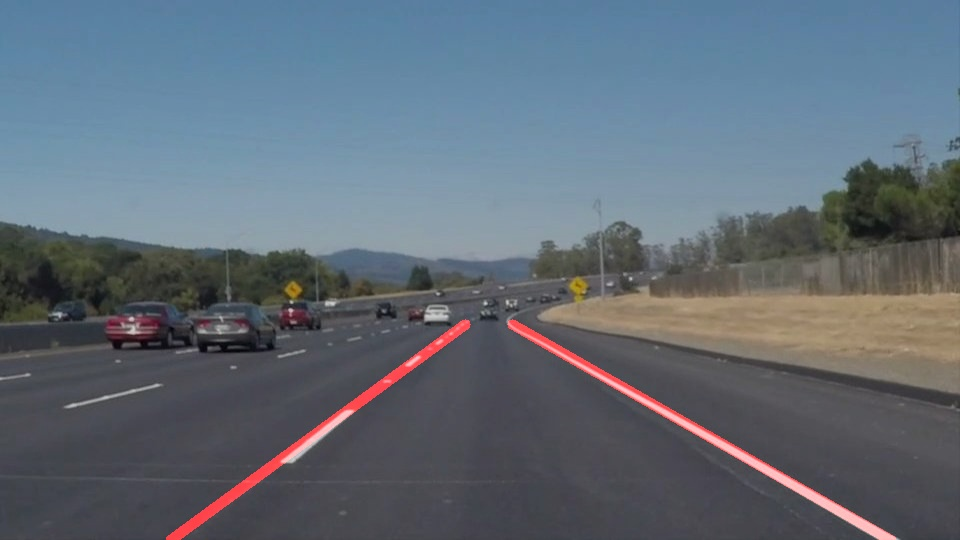
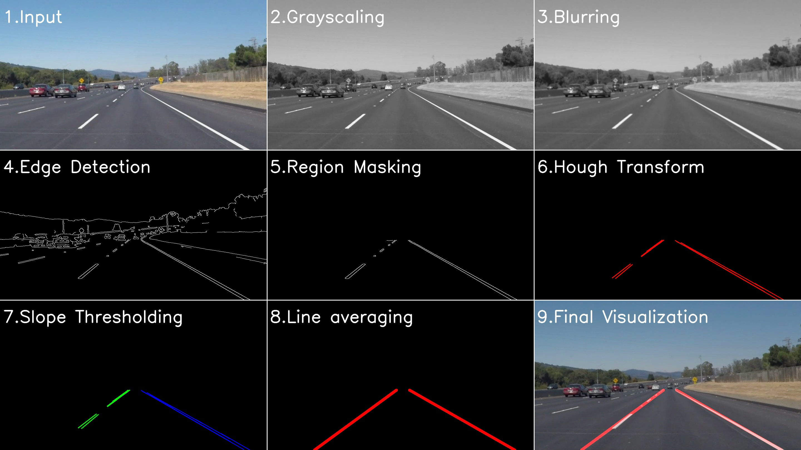
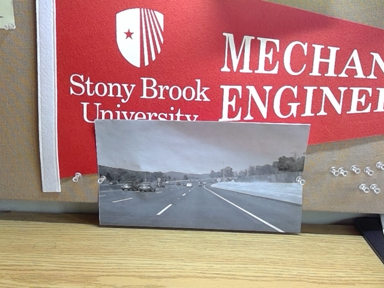
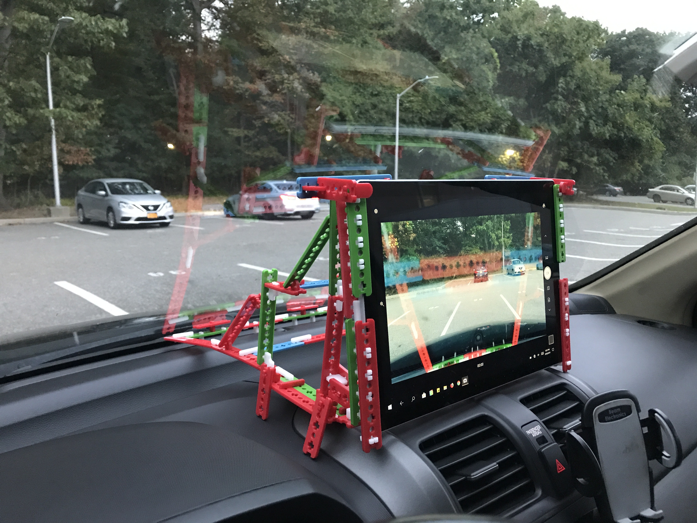

# **Finding Lane Lines on the Road** 

When humans drive on the road, we rely heavily on lane line-markings to steer our vehicles. The objective of this project is to teach the lane detection ability to a computer as shown in the video below. 

Images and video files from a dashcam mounted in a car is used as input. Jupyter notebook, Python and OpenCV are used to detect and visualize the lane lines in the input. The anaconda environment being used is available as the [CarND Term1 Starter Kit](https://github.com/udacity/CarND-Term1-Starter-Kit/blob/master/README.md) (if you run any errors, update the packages).

## Image Processing Pipeline ([link](http://htmlpreview.github.io/?https://github.com/ssharma1991/autonomous-car-basic-lane-detection/blob/master/ImagePipeline.html))

To find the lane lines on a road, a pipeline consisting of computer vision techniques is implemented in the following sequence:
1. **Input:** An Input image is received by the pipeline. It can be scaled down to improve algorithm speed.
2. **Grayscaling:** The first operation is the grayscaling operation. The operation reduces the color channels from three to one. This improves algorithm speed. 
3. **Blurring:** Then, a gaussian blur is applied to decrease noise. A `kernel_size= 5x5` was empirically determined for this project.
4. **Edge Detection:** Next, Canny edge detection is used to isolate prominent edges in the image. A `low_threshold=50` and `high_threshold=150` for pixel intensity were empirically determined for this project. The result is a binary image. 
5. **Region Masking:** The relevant part of the image which contains lane information is then isolated using a polygon mask. This eliminates the extraneous edges from the images.
6. **Hough Transform:** To convert pixel data into raw line segment data, Hough transform is used. The hyper-parameters are empirically determined. Resolution parameters are `rho=2px` and `theta=2 degrees`. The minimum intersection threshold was set as `threshold=40`. The line parameters were set as `min_length=30px` and `max_gap=20px`.
7. **Slope Thresholding:** Raw line segment data is classified into left and right lanes depending on slope values. Line segments whose slopes satisfy `-.25 <slope <.25` are not considered since these lines don't represent lane lines.
8. **Line Averaging:** Raw lane lines are aggregated into a unique lane line hence completing the lane detection process. Aggregation is done using an average of slopes and midpoints of raw line segments.
9. **Final Visualization:** The detected lane lines are superimposed with the initial dashcam image for visualization and analyzing errors.

The image below displays each step in the pipeline.

## Execution time analysis

In this section, we analyze the time taken by each step in our algorithm. All benchmarks are done on my **Surface Pro 5** with an **Intel Core i5-7300U CPU** and **8GB RAM**. The execution time has been estimated using `timeit` module. It repeatedly runs a function and determines the mean and deviation of run-time. The execution time of each step in the above algorithm is

|Process                 |Execution Time (ms)|
|------------------------|-------------------|
|Importing Image         |11.7               |
|Resizing Image          |0.7                |
|Grayscaling             |0.1                |
|Blurring                |0.1                |
|Edge detection          |1.3                |
|Region Masking          |0.1                |
|Hough Transform         |1.2                |
|Slope Thresholding      |2.3                |
|Line Averaging          |0.6                |
|Final Image creation    |0.9                |
|Detail Image creation   |14.1               |

As can be observed by the table, processing one image takes a total of **33.1ms**. However, almost **80%** of execution time is taken by the first and last steps. Thus, for an efficient real-time video-processing pipeline, the focus needs to be on improving the steps of importing and visualizing data.

Assuming a camera can capture video at 60 frames per second(fps), the time between each frame will be **16ms**. The execution time of the image processing pipeline has to be lesser than 16ms for our algorithm to process such a video. Excluding the importing and visualization steps, our pipeline takes **7.3ms** which satisfies this criterion. criterion. 

## Video Processing Pipeline ([link](http://htmlpreview.github.io/?https://github.com/ssharma1991/autonomous-car-basic-lane-detection/blob/master/VideoPipeline.html))

First, we implement a video pipeline that works with pre-recorded videos.

With video format, we work with a series of images instead of just one image. It is obvious that drastic changes in lane location is impossible within negligible time and smoothening the changes would benefit the pipeline. Thus, we can make our algorithm more robust using past data. `draw_lanes()` function has been updated to combine present lane location info with past info to make better predictions. Otherwise, the video pipeline remains very similar to the image pipeline. `MoviePy` module is used to assist in video processing.

The result can be seen in the video below.

Since the processing is done on prerecorded data and not real-time in nature, the efficiency is not as important.

## Camera Processing Pipeline ([link](http://htmlpreview.github.io/?https://github.com/ssharma1991/autonomous-car-basic-lane-detection/blob/master/CameraPipeline.html))

Next, we aim to develop a camera pipeline that processes live video streams. Due to the real-time nature of live-stream, efficiency is important.

Since dashing to my car with untested code is not the best idea, I start with a controlled environment. To test and debug my realtime camera pipeline, I have printed out an image of the road and pinned it on my study table. The setup is shown in the image below.

Displaying Real-time Camera feed in `Jupyter notebook` turned out to be somewhat challenging. The use of `pyplot`, `pylab`, `PIL`, and `cv2` for displaying the camera feed was not possible due to poor 2-3 fps performance. The performance using `IPython.display` module was much better. We were able to get 31-32fps on displaying the camera feed within the Jupyter notebook. However, the feed was flashing due to the use of `clear_output()` function. Finally, the use of `ipywigets` was explored. Even though the camera feed was displayed at a slightly slower 29-30fps, the display didn't flash. Thus, this approach was accepted as a good compromise and used for the project.

In my benchmarks, I observed that the camera pipeline works close to **15 fps** which is satisfactory performance. All benchmarks were done on my **Surface Pro 5** with an **Intel Core i5-7300U CPU** and **8GB RAM**. Here is a video of the camera pipeline in action in the test environment. 

Next, I develop a fixture to prop my tablet to my car's windscreen. I use [SnappyXO](http://snappyxo.com/) parts, a laser-cut robotics platform built by my research group, to create the fixture design. The complete setup with the tablet looks something like this.

It's showtime. Let's run our camera pipeline on an actual vehicle and see how it performs. Here is what the output looks like.

Each step in the camera pipeline is visualized in the video below.

## Limitations
A huge hurdle in generalizing this approach is the selection of optimum Image Processing hyper-parameters. Since these parameters were determined empirically using a very limited dataset (single car, one highway, daytime, sunny, etc.), the algorithm works poorly if used in other situations. Sample situations where the above-described approach could work poorly are:
* Changes in road material from darker asphalt to concrete (like on bridges or overpasses).
* Shadows on the road from nearby objects (like trees or buildings).
* Debris/dirt in lanes, especially near dash lines. 
* Change in weather conditions (like rainy or snowy).
* Varied lighting at different times in a day or night.

## Possible Improvements

* Use of lane colors to isolate the lanes could also be better than using a grayscale image. However, that would require more computation power.
* Use of curves instead of straight lines could be used to better represent the lane lines
