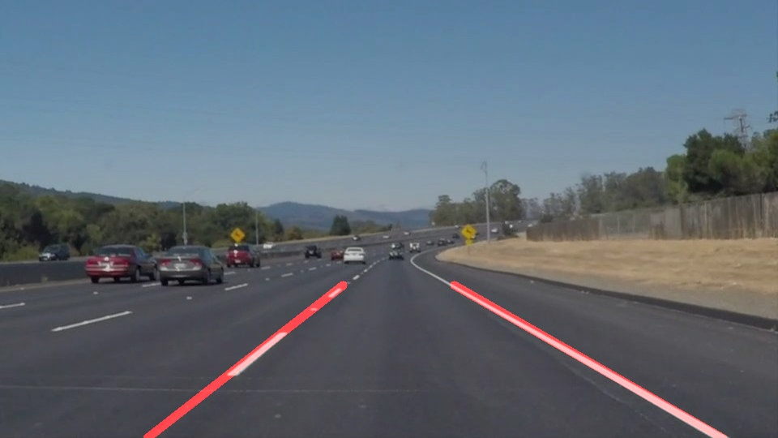
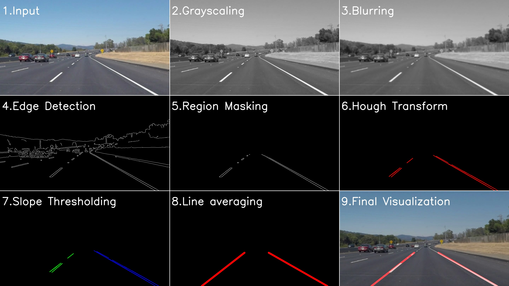

# **Finding Lane Lines on the Road** 

When humans drive on the road, we rely heavily on lane line-markings to steer our vehicles. The objective of this project is to teach the lane detection ability to a computer as shown in the image below. 

Images and video files from a dashcam mounted in a car is used as input. Jupyter notebook, Python and OpenCV are used to detect and visualize the lane lines in the input. The anaconda environment being used is available as the [CarND Term1 Starter Kit](https://github.com/udacity/CarND-Term1-Starter-Kit/blob/master/README.md) (if you run any errors, update the packages).

## Image Processing Pipeline

To find the lane lines on a road, a pipeline consisting of computer vision techniques is implemented in the following sequence:
1. **Input:** An Input image is received by the pipeline. It can be scaled down to improve algorithm speed.
2. **Grayscaling:** First operation is the grayscaling operation. The operation reduces the color channels from three to one. This improves algorithm speed. 
3. **Blurring:** Then, a gaussian blur is applied to decrease noise. A `kernel_size= 5x5` was empirically determined for this project.
4. **Edge Detection:** Next, Canny edge detection is used to isolate prominent edges in the image. A `low_threshold=50` and `high_threshold=150` for pixel intensity were empirically determined for this project. The result is a binary image. 
5. **Region Masking:** The relevant part of the image which contains lane information is then isolated using a polygon mask. This eliminates the extraneous edges from the images.
6. **Hough Transform:** To convert pixel data into raw line segment data, Hough transform is used. The hyper-parameters are empirically determined. Resolution parameters are `rho=2px` and `theta=2 degrees`. Minimum intersection threshold was set as `threshold=40`. The line parameters were set as `min_length=30px` and `max_gap=20px`.
7. **Slope Thresholding:** Raw line segment data is classified into left and right lanes depending on slope values. Line segments whose slopes satisfy `-.25 <slope <.25` are not considered since these lines don't represent lane lines.
8. **Line Averaging:** Raw lane lines are aggregated into unique lane line hence completing the lane detection process. Aggregation is done using an average of slopes and midpoints of raw line segments.
9. **Final Visualization:** The detected lane lines are superimposed with initial dashcam image for visualization and analyzing errors.

The image below displays each step in the pipeline.

## Execution time analysis

In this section, we analyze the time taken by each step by our algorithm. The execution time has been estimated using `timeit` module. It repeatedly runs a function and determines the mean and deviation of run-time. The execution time of each step in the above algorithm is

|Process                 |Execution Time (ms)|
|------------------------|-------------------|
|Importing Image         |17.7               |
|Resizing Image          |0.8                |
|Grayscaling             |0.3                |
|Blurring                |0.3                |
|Edge detection          |1.3                |
|Region Masking          |0.1                |
|Hough Transform         |1.3                |
|Slope Thresholding      |2.6                |
|Line Averaging          |0.6                |
|Final Image creation    |1.3                |
|Detail Image creation   |14.4               |

As can be observed by the table, processing one image takes a total of **40.7ms**. However, almost **80%** of execution time is taken by the first and last step. Thus, for an efficient real-time video-processing pipeline, the focus needs to be on improving the steps of importing and visualizing data.

Assuming a camera can capture video at 60 frames per second(fps), the time between each frame will be **16ms**. The execution time of the image processing pipeline has to be lesser than 16ms for our algorithm to process such a video. Excluding the importing and visualization steps, our pipeline takes **8.6ms** which satisfies this criterion. 

## Limitations
A huge hurdle in generalizing this approach is the selection of optimum Image Processing hyper-parameters. Since these parameters were determined empirically using very limited dataset (single car, one highway, daytime, sunny, etc.), the algorithm works poorly if used in other situations. Sample situations where the above-described approach could work poorly are:
* Changes in road material from darker asphalt to concrete (like on bridges or overpasses).
* Shadows on the road from nearby objects (like trees or buildings).
* Debris/dirt in lanes, especially near dash lines. 
* Change in weather conditions (like rainy or snowy).
* Varied lighting at different times in a day or night.

## Possible Improvements

* One possible improvement could be using data from the previous timestep to calculate lane readings. It is obvious that drastic changes in lane location is impossible within negligible time and smoothening the changes would benefit the pipeline.
* Use of lane colors to isolate the lanes could also be better than using a grayscale image. However, that would require more computation power.
* Use of curves instead of straight lines could be used to better represent the lane lines
